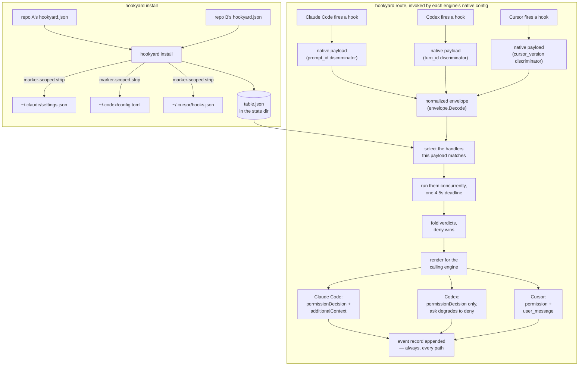

# hookyard

Register agent hooks once, route them to every coding agent.

Claude Code, Codex and Cursor each declare hooks in their own config format,
under their own event names, with their own payload shape. hookyard is a
standalone static binary that holds one declarative table of which handler
runs on which event on which engine, renders that table into each engine's
native config, and — when an engine fires a hook — decodes the payload into a
normalized shape, runs the matching handlers concurrently under a shared
deadline, folds their verdicts with a deny-wins consolidation, and renders the
result in the shape the calling engine accepts. All three engines have a
confirmed deny path, so a guard enforces on all three; a decision only has
somewhere to land on `pre_tool` (plus a handful of Cursor-scoped events), so a
verdict on any other event is recorded but not enforced, and an `allow`
rendered to Codex is recorded rather than enforced too — Codex rejects an
explicit allow by name, so nothing is printed and its own permission flow
runs instead. An `ask` is not one of those cases: on Codex, whose decision
shape is binary, a consolidated `ask` degrades to an enforced `deny` with a
reason explaining why.

## How it works

Two passes. `hookyard install` writes the table down into every engine's
config; `hookyard route` is what an engine actually invokes when a hook
fires.



A few things worth calling out because they're not visible from the
`hookyard` label alone: each engine's writer strips only its own
marker-tagged entries out of a config file it shares with other writers, and
refuses to touch a file it cannot parse rather than clobbering it — on Codex
that matters because `config.toml` also holds the per-project trust store.
Each engine's payload and rendered verdict are genuinely different shapes,
not the same JSON dressed up three ways — Codex's `hookSpecificOutput` has no
`ask` or advisory field at all, and Cursor folds a reason and any advice into
one `user_message` string because it has exactly one text slot. And the
record is appended on every path through `route`, including a call that
belongs to another engine's config entirely (`route` and its `--registered-for`
flag disagree, so nothing runs and the record says `suppressed`) — the record
is what makes a silently misfiring or disabled guard recoverable after the
fact, so it can't depend on anything actually firing.

## Build and install

```
nix build .#default   # -> result/bin/hookyard
nix develop            # devShell with the Go toolchain and formatters
```

Once you have a binary on `PATH`:

```
hookyard validate --manifest path/to/hookyard.json
hookyard install  --manifest path/to/hookyard.json [--manifest ...]
hookyard doctor
```

`install` renders every manifest it is given into all three engines' native
config in one pass — it takes the full list, never one repo at a time,
because its strip is keyed on a marker that does not record which manifest
produced a row.

`doctor` answers the question the event record cannot: every engine skips
hooks entirely in a directory the user has not trusted, and a handler that
never runs cannot report that it didn't.

## Wiring hookyard into a consumer repo

A consumer takes hookyard as a flake input and imports its home-manager
module:

```nix
{
  inputs.hookyard.url = "github:noamsto/hookyard";

  # inside the home-manager configuration:
  imports = [ inputs.hookyard.homeModules.default ];
  programs.hookyard = {
    enable = true;
    manifests = [ ./hookyard.json ];
  };
}
```

`manifests` is the whole of a consumer's contribution, and it is a shared
list: every module that sets it contributes paths to the same list, rendered
into all three engines' native config by one `hookyard install` invocation,
owned by hookyard's own module and run from `home.activation.hookyardInstall`.
A consumer never pins its own hookyard input and never adds its own
activation entry that calls `hookyard install` directly: the strip that
removes hookyard's rows on re-render is keyed on a marker that does not
record which manifest produced a row, so a second invocation would silently
delete the first one's rows rather than merge with them. One input, one
binary, one rendering pass, and consumers contribute data to it rather than a
second copy of the mechanism.

A manifest's `exec` must be an absolute path that already exists at
activation time — `install` stats it, and a manifest that fails the stat
aborts the whole home-manager generation switch. That is deliberate: the
alternative is registering a handler that silently never runs, which is the
same fail-open the guard exists to prevent, just moved from hook-fire time to
install time instead of caught at all. The practical consequence is that a
handler built by the same flake needs a manifest generated with
`pkgs.writeText`, embedding the handler's own store path, rather than a
checked-in JSON file naming a path Nix had no chance to fill in.

Turning hookyard off goes in a specific order: empty `manifests`, activate,
*then* set `enable = false`. Flipping `enable` off first removes the binary
from the profile while the three engines' configs still name it, so the path
each config points at now fails at `exec` instead of resolving — exactly the
fail-open §9 of the design doc spends its argument on. Emptying
`manifests` first runs `install` with nothing registered, which strips
hookyard's rows from all three configs while the binary is still there to do
it; only then is it safe to drop the package itself. `hookyard doctor`'s
`router path` check is what catches a machine left in the wrong order — it
confirms the path each engine's config names is actually there to exec,
alongside the trust and confirmed-deny checks it already runs.

The three destination files — Claude Code's `settings.json`, Codex's
`config.toml`, Cursor's `hooks.json` — must be plain files that hookyard
itself owns, not symlinks placed by another Nix module. `install` refuses to
render into one rather than replace it, because replacing it would silently
detach whatever manages the link with no warning at the next switch. On this
machine `~/.claude/settings.json` is itself a home-manager-managed symlink
today, so registering Claude Code hooks needs one of the two ways out:
`programs.hookyard.claudeSettings` pointed at a file hookyard can own, or the
module that currently manages that symlink stepping aside for hookyard. The
same option exists for the other two engines as `codexConfig` and
`cursorHooks`.

## The manifest

A manifest is a JSON file with a list of handlers. Each handler declares
which events it wants, on which engines, and — optionally — which normalized
tool names to filter on:

```json
{
  "handlers": [
    {
      "id": "block-secrets",
      "exec": "/home/you/bin/guard-secrets",
      "events": ["pre_tool"],
      "engines": ["claude-code", "codex", "cursor"],
      "match": ["Bash"],
      "timeout_ms": 2000
    }
  ]
}
```

- `exec` must be an absolute path to an executable file — it's resolved at
  hook-fire time against the agent's own working directory and `PATH`, not
  the installer's, so a relative path or a bare name would let whatever
  happens to sit there stand in.
- `events` are one of the six canonical events, or `engine:NativeName` for an
  event only one engine has.
- `engines` is any of `claude-code`, `codex`, `cursor`.
- `match` filters by normalized tool name; an empty list matches every tool.
  A tool with no equivalent on a claimed engine — Codex has no `Grep` or
  `Glob`, Cursor has no `Glob` — fails validation rather than installing a
  handler that would never fire there.
- `timeout_ms` is optional and capped at 4300ms (`manifest.MaxHandlerTimeoutMS`):
  the router's own 4.5s deadline minus the margin it needs to consolidate and
  return before the engine's own timeout.

This exact manifest, with `exec` pointed at a real executable, validates
clean:

```
$ hookyard validate --manifest hookyard.json
1 manifests, 1 handlers, no problems found
```

## The event record

Every call routed through `hookyard route` appends one JSON line to an
append-only stream, whether or not anything is subscribed to it and
regardless of what the verdict was. It lives at
`$HOOKYARD_STATE_DIR/stream/YYYY-MM-DD.jsonl` (falling back to
`$XDG_STATE_HOME/hookyard`, then `~/.local/state/hookyard`), one file per UTC
day, written at `0600`. Files older than 14 days are swept on the first write
of a new day. This is the thing that makes a silently disabled or misfiring
guard recoverable: `doctor` tells you whether hooks are wired up right now,
and the record tells you what actually happened over the last two weeks even
if they weren't.

## Vocabulary

hookyard translates between its own normalized names and each engine's
native ones; see [`internal/vocab`](internal/vocab) for the full tables.
The six canonical events are `session_start`, `prompt_submit`, `pre_tool`,
`post_tool`, `pre_compact` and `turn_end`. The normalized tool names are
`Read`, `Write`, `Bash`, `Grep` and `Glob`.

## More

The design, and the verification behind it, is in
[`docs/design/hookyard.md`](docs/design/hookyard.md). Real captured hook
payloads for all three engines are in
[`docs/design/fixtures/hook-payloads/`](docs/design/fixtures/hook-payloads/).
