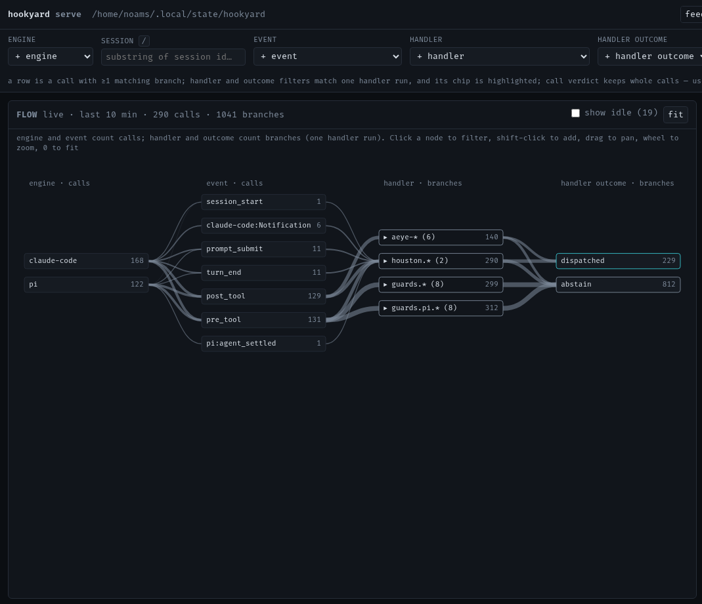
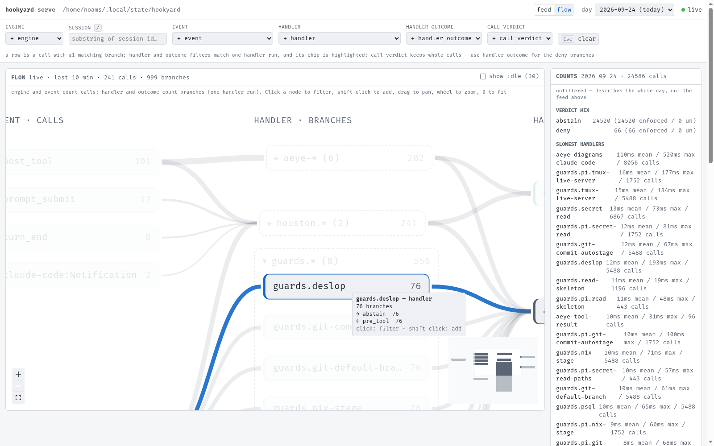
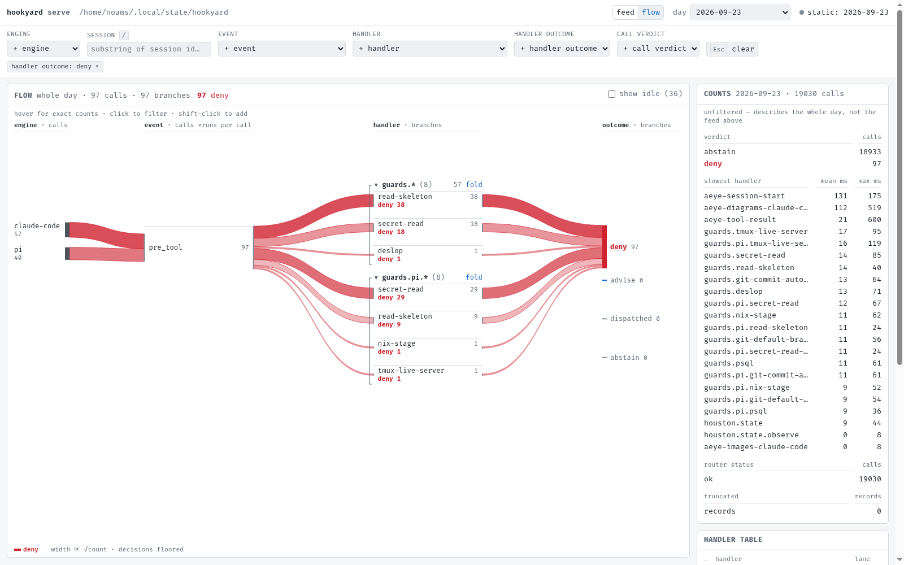

# hookyard

**Write an agent hook once. Run it in Claude Code, Codex, Cursor and Pi.**

Every coding agent has its own hook config, its own event names and its own
payload shape. hookyard is one static binary that sits between them and your
handlers: declare each handler once in a manifest, and hookyard registers it
with every engine, translates each hook call into one normalized envelope, and
answers each engine in the format it expects.

- **One manifest, four engines.** No per-agent copies of the same guard.
- **Deny wins.** Handlers run concurrently and their verdicts fold
  `deny > ask > allow`; a handler with nothing to say never overrides one that
  objects.
- **Bounded.** Every call shares one 4.5s deadline, so a slow or broken handler
  abstains instead of hanging the agent.
- **On the record.** Every routed call is appended to a local event log, so a
  guard that quietly stopped firing shows up after the fact.
- **`hookyard doctor`** checks trust, registration and router paths per engine.

## Status

**Yard mode** ships today: machine-wide install, routing and the event record,
for guards that need machine-wide enforcement. It runs with or without Nix.
**Build mode**, generating per-engine plugin hooks so end users never see
hookyard, is the planned open-source default and not yet implemented
([design §3.1](docs/design/hookyard.md)).

## How it works

Manifests from any number of repos fold into one `hookyard install` pass, out
to Codex's, Cursor's and Pi's native config plus hookyard's own state table.
`hookyard emit` is a separate pass Nix runs at build time for Claude Code: it
reads no manifests, and instead renders one route row per event in a fixed,
eight-event catalog — it's the state table, the same one `install` writes,
that decides which handlers actually run for Claude Code, same as for the
other three engines:

<picture>
  <source media="(prefers-color-scheme: dark)" srcset="docs/diagrams/registration-dark.svg">
  
</picture>

When a hook fires, `hookyard route` normalizes the payload, runs the matching
handlers, folds their verdicts and renders the answer for the calling engine:

<picture>
  <source media="(prefers-color-scheme: dark)" srcset="docs/diagrams/routing-dark.svg">
  
</picture>

## Quick start

Take a binary from the [releases](https://github.com/noamsto/hookyard/releases),
or build one:

```
go install github.com/noamsto/hookyard/cmd/hookyard@latest
nix build .#default   # the same binary through Nix -> result/bin/hookyard
nix develop            # devShell with the Go toolchain and formatters
```

Write a manifest:

```json
{
  "handlers": [
    {
      "id": "block-secrets",
      "exec": "/home/you/bin/guard-secrets",
      "events": ["pre_tool"],
      "engines": ["claude-code", "codex", "cursor"],
      "match": ["Bash"],
      "timeout_ms": 2000
    }
  ]
}
```

A handler reads hookyard's envelope on stdin, with the engine's own payload
under `.native`, and, to object, prints a `hookSpecificOutput` with a
`permissionDecision`. Then:

```
hookyard validate --manifest hookyard.json
hookyard install  --manifest hookyard.json [--manifest ...] --claude-settings ~/.claude/settings.json
hookyard doctor
```

`install` writes Codex's, Cursor's and Pi's config, and with
`--claude-settings`, Claude Code's. Pass every manifest to one `install` call.
Under Nix, leave `--claude-settings` off: Claude Code's hooks ride the overlay
below instead ([without Nix](docs/yard-mode.md#without-nix) has the details).

## With Nix

Take hookyard as a flake input and contribute manifests to its home-manager
module:

```nix
{
  inputs.hookyard.url = "github:noamsto/hookyard";

  # inside the home-manager configuration:
  imports = [ inputs.hookyard.homeModules.default ];
  programs.hookyard = {
    enable = true;
    manifests = [ ./hookyard.json ];
  };
}
```

Every module adds to the same `manifests` list, and hookyard's own module runs
the single `install` pass. Wire `programs.hookyard.claudeOverlay.merged` into
Claude Code's `--settings` overlay — it's a build-time `hookyard emit`
derivation, not something `manifests` reaches. Before relying on it, read
[yard mode in depth](docs/yard-mode.md#consumer-repos): it covers why a
consumer must never run its own `install`, the order for turning hookyard off,
and which destination files it refuses to write.

## The manifest

Each handler names its `events`, `engines`, an optional tool `match` and a
`timeout_ms` (capped at 4300ms). Handlers that return no verdict can run in the
`fire_and_forget` lane. The full field reference and the normalized event and
tool names are in [yard mode in depth](docs/yard-mode.md#manifest-fields).

## The event record

Every call through `hookyard route` appends one JSON line to
`~/.local/state/hookyard/stream/`, whatever the verdict, and keeps 14 days.
`doctor` tells you whether hooks are wired up right now; the record tells you
what actually happened.

### Watching it live

`hookyard serve [--port 7757]` opens a read-only view of the record on
`http://127.0.0.1:7757`. It binds loopback only and loads nothing from the
network. It has two views, and one filter bar applies to both.

**Filters.** Six fields: engine, session, event, handler, handler outcome,
call verdict. Engine, event, handler, handler outcome and call verdict each
have an "add" picker; session is a free-text input. Every active value shows
as a chip (`field: value ×`) in the bar; values within a field OR, different
fields AND. Esc or "clear" drops everything. The bar mirrors to the URL, so a
filtered view is a shareable link.

Engine, session, event and call verdict filter whole calls. Call verdict is
the call's consolidated verdict (`allow`/`ask`/`deny`/`abstain`/`suppressed`)
or its router status (`ok`/`error`/`timeout`) — never a handler's own
outcome. Handler and handler outcome instead filter one handler *run* within
a call (a "branch"): set together, they must hold on the same run, so
`handler=guards.deslop&outcome=deny` means deslop's own deny, not "deslop ran
and something else denied". `outcome=router-error` selects calls that never
reached fan-out. Handler outcomes used to also match `verdict=`; they no
longer do — use `outcome=` instead (e.g. `outcome=dispatched`).

A feed row is a call with at least one matching handler run. Under a handler
or handler-outcome filter, the row's matching handler chips are highlighted
and the rest dimmed. The flow graph draws only the matching branches — same
rule, same filter.

- **feed** — every call, newest first, live for today and paged for past days.
- **flow** — the pipeline as a graph, engine → event → handler → outcome,
  rendered with React Flow and laid out by ELK. Engine and event count
  calls; handler and handler outcome count branches (one handler run), and
  the column headers say so. The last hop is each handler's *own* outcome,
  not the call's consolidated verdict, so a deny shows which guard denied
  it. Calls with no handler go straight from event to their verdict
  (`abstain` or `suppressed`) along a dashed edge. Router errors lead to a
  `router error` node. A handler that ran but is no longer in the installed
  table appears dashed. On today, edge thickness is the last 10 minutes of
  traffic (day files are UTC, so the window starts over at UTC midnight),
  and each live call pulses along its path. A past day shows static
  whole-day totals.

  Handlers are grouped by id prefix (`guards.*`, `guards.pi.*`, `aeye-*`,
  `houston.*`) into collapsible containers; click a group's header to
  expand or collapse it. A group holding a filtered handler is forced open
  — a pin cue on its header, and the click does nothing — and under a
  handler or handler-outcome filter, small groups open on their own. A
  group you toggle by hand stays that way across live updates, day
  switches and other filter changes, but resets to the default (forced or
  auto) as soon as the handler or handler-outcome filter values change, so
  switching to a new filter never leaves a group collapsed that filter
  would otherwise open. Idle nodes (no traffic in the window) are hidden;
  "show idle" brings them back. Wheel or pinch zoom around the cursor, drag
  pans, the MiniMap and Controls' fit button and `+`/`-`/`0` do the same
  from the keyboard. Hovering a node highlights every path through it with
  a tooltip of counts. Clicking a node filters by it — shift/ctrl-click
  adds it instead of replacing, and clicking an active node removes it.





**Building the flow view.** Its source lives in `internal/serve/web`
(React Flow + ELK, esbuild-bundled); the built output under
`internal/serve/assets/flow/` is a committed generated artefact, and the
`flow-bundle` nix check fails if it drifts from source. After changing
`web/src/`, rebuild from `internal/serve/web` with `npm ci && npm run
build`, and `npm test` for the model unit tests. `npm run e2e` drives a
real Chromium over CDP — set `CHROME=/path/to/chromium` if it isn't on
`PATH`.

### Session lifecycle for dashboards

The six canonical events carry no "the agent finished and is idle" concept, so
three lifecycle signals are routed under explicit engine-scoped names. Each
appends a normal record with `canonical_event: ""`; a subscriber keys on
`engine` + `native_event`:

| `engine` | `native_event` | when it fires |
| --- | --- | --- |
| `pi` | `agent_settled` | the whole pi run has settled — after retries, compaction retries and queued follow-ups — i.e. pi is idle and waiting on the human. Also fires on an aborted (Esc) run, unlike the per-turn `turn_end`. |
| `codex` | `SessionEnd` | the codex session ends. |
| `cursor` | `sessionEnd` | the cursor session ends. |

Every record also carries `engine`, `session_id`, `cwd`, `verdict` and
`router`, as every other event does. `codex:SessionEnd` sends no engine
discriminator on the wire, so it routes only in yard mode, where the config's
own `--registered-for` supplies the engine. See [hookyard.md §7](docs/design/hookyard.md)
and the fixtures README's [session-end payloads that are inferred, not
captured](docs/design/fixtures/hook-payloads/README.md#session-end-payloads-that-are-inferred-not-captured);
the codex and cursor payloads are inferred from their shipped builds, not
captured, and only the pi payload has a fixture.

## More

- [Yard mode in depth](docs/yard-mode.md): per-engine verdict rendering,
  consumer wiring, manifest reference.
- [Design doc](docs/design/hookyard.md): the design and the verification
  behind it.
- [Captured hook payloads](docs/design/fixtures/hook-payloads/) for all four
  engines.
